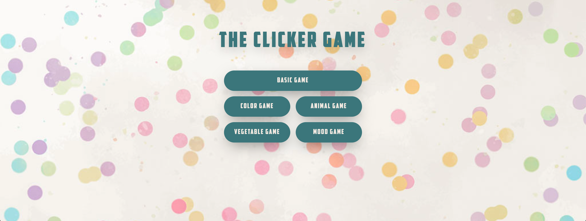
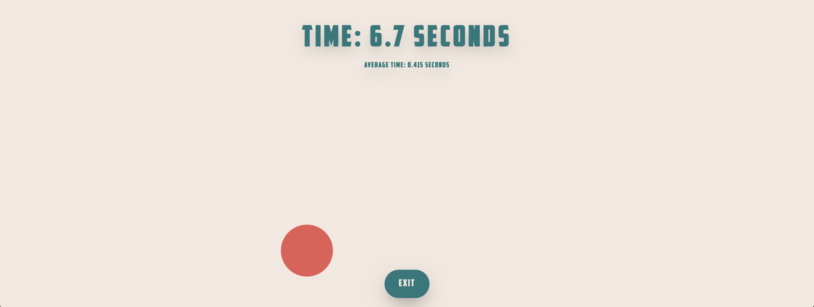
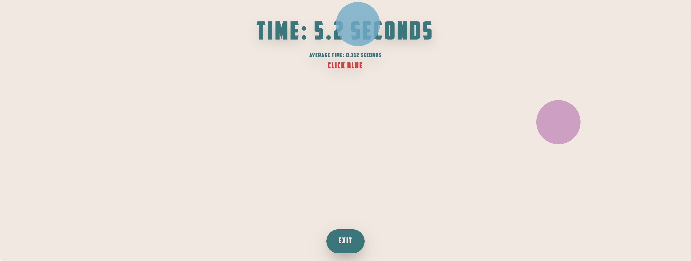
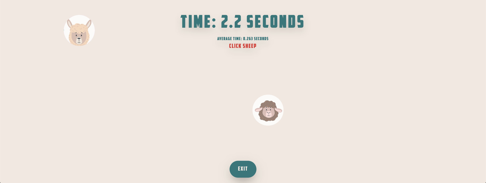
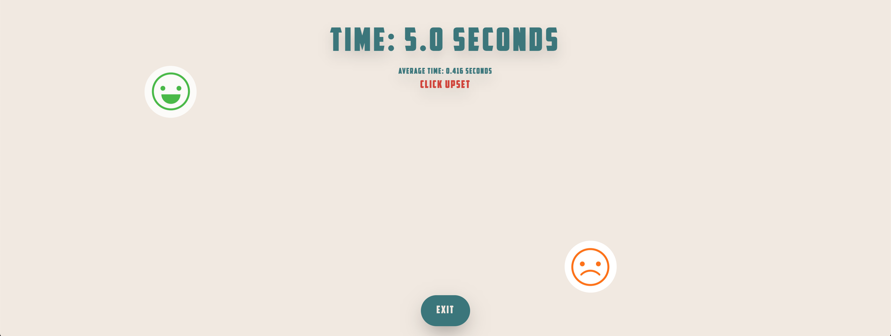
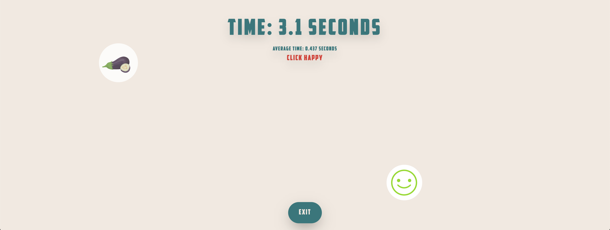
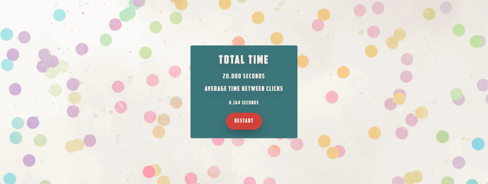

# The Clicker Game

The Clicker Game is an engaging and interactive application designed to improve hand-eye coordination and reflex responses, all 
while providing a fun and entertaining experience. This game is tailored for kids and offers a variety of modes to keep them engaged and entertained. Whether you're looking to enhance your clicking speed, enjoy colorful visuals, or learn about animals, moods, and vegetables, The Clicker Game has something for everyone.

More about [how we came up with this little game idea](https://kaihochak.github.io/clicker.html).

## Contributors

- Kai Ho Chak
- Htet Myet Aung Naing
- Kusumpreet Kaur Heer
- Logan Perry-Din

## Installation

Getting started with The Clicker Game is a breeze. 

[Click here to play](https://example.com/your-demo-page](https://clickkerrrr.glitch.me)!

OR Follow these simple steps to run the game on your local machine:

1. Clone the repository to your computer using your preferred version control tool or by downloading the ZIP archive.
2. Open your favorite code editor or integrated development environment (IDE).
3. Run the game on a local server using your IDE's live server feature.
4. That's it! You're ready to enjoy The Clicker Game on your own machine.

## Game Modes

### 1. Basic Mode

- **Objective:** Click the circle as fast as possible.
- **Gameplay:** Click the circle to register a click. The game ends after 10 clicks.
- **Features:** 
  - A timer to track your progress.
  - An average time in seconds between clicks.
  - The ability to end the game and return to the home screen.

### 2. Color Mode

- **Objective:** Enjoy visual stimulation and color recognition.
- **Gameplay:** Follow the prompts and click on the correct color.
- **Features:** 
  - Colorful and engaging visuals.
  - Exciting color-based challenges.

### 3. Animal Mode

- **Objective:** Have fun and learn about animals.
- **Gameplay:** Match the prompts with the correct animal picture.
- **Features:** 
  - A wide variety of adorable animal images.
  - Educational and entertaining gameplay.

### 4. Mood Mode

- **Objective:** Explore various moods and emotions.
- **Gameplay:** Match the prompts with the corresponding mood picture.
- **Features:** 
  - Engaging visuals depicting different moods.
  - An entertaining and emotionally stimulating experience.

### 5. Vegetable Mode

- **Objective:** Learn about different vegetables.
- **Gameplay:** Match the prompts with the correct vegetable picture.
- **Features:** 
  - Fun and educational gameplay focused on vegetables.
  - A chance to expand your knowledge about healthy foods.

## End Screen

After completing each mode, you'll see your results, allowing you to track your progress and strive for improvement. From here, you can easily restart the game or return to the home screen to explore other modes.

Get ready to have a blast, improve your coordination, and learn new things with The Clicker Game!
